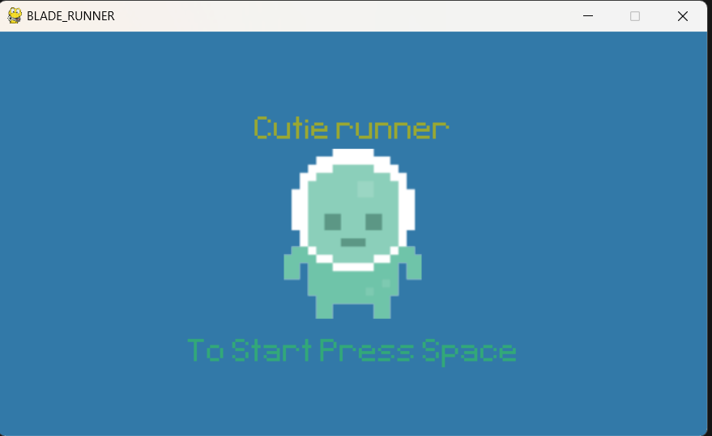
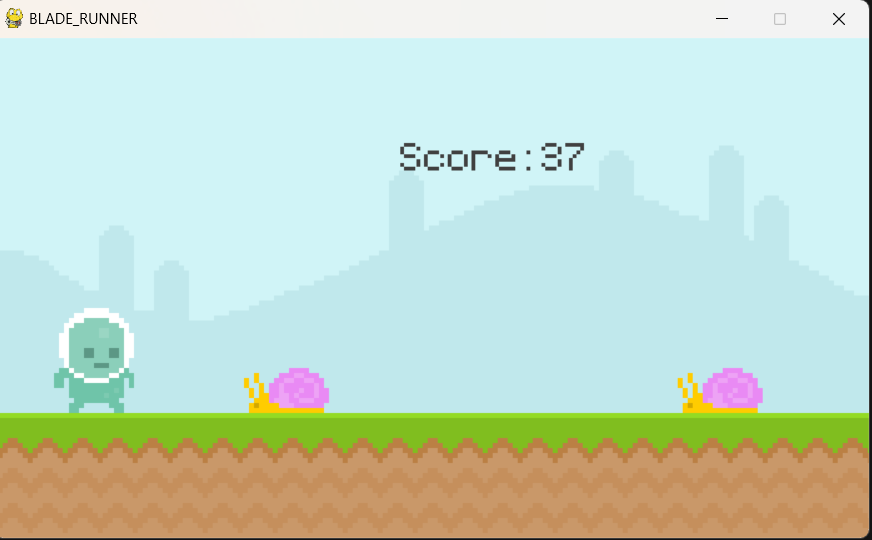

# Pygame Runner Project

## Overview
This project is designed to help understand the nitty-gritty details of the Pygame module. It includes a basic runner-style game that can be executed using either `runner_class_only.py` or `runner_video.py`. Future improvements could involve implementing multiplayer functionality for offline settings and adding a leaderboard system.

## Installation and Setup
Follow these steps to set up and run the project:

### 1. Clone the Repository
```sh
git clone https://github.com/jbl302/blade_runner_game.git
cd UltimatePygameIntro-main
```

### 2. Install Dependencies
Make sure you have Python installed, then install Pygame using:
```sh
pip install pygame
```

### 3. Verify Asset Paths
Check that all required assets (images, sounds, etc.) are correctly located in the specified directories. If necessary, update the paths in the script files.

### 4. Run the Game
You can start the game by executing one of the following scripts:
```sh
python runner_class_only.py
```
or
```sh
python runner_video.py
```
## Demo
Here are some screenshots of the game in action:




## Future Improvements
- **Multiplayer Mode:** Allow multiple players to compete in an offline setting.
- **Leaderboard System:** Implement a scoring mechanism and store top scores.
- **Enhanced Graphics & Animations:** Improve the visual appeal of the game.
- **Sound Effects & Background Music:** Add immersive audio elements.

